# School Database (SchoolDB) Setup Instructions

## 2. Database Structure

### 2.1. Create Database

- **Database Name**: `SchoolDB`
  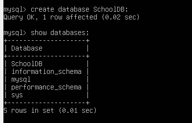

### 2.2. Tables

#### 2.2.1. Table: `Institutions`

This table will store information about educational institutions, such as schools and kindergartens.

- **Fields**:
   - `institution_id`: Primary key, auto-increment
   - `institution_name`: Name of the institution
   - `institution_type`: Type of the institution (School or Kindergarten)
   - `address`: Address of the institution
  
     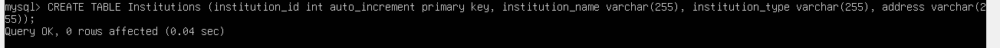
  
#### 2.2.2. Table: `Classes`

This table will store information about classes or educational directions provided by the institutions.

- **Fields**:
   - `class_id`: Primary key, auto-increment
   - `class_name`: Name of the class
   - `institution_id`: Foreign key referencing `Institutions`
   - `direction`: Educational direction (Mathematics, Biology and Chemistry, Language Studies)
  
     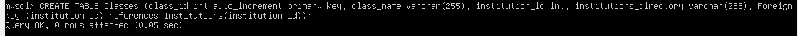
  
#### 2.2.3. Table: `Children`

This table will store details about children attending various institutions.

- **Fields**:
   - `child_id`: Primary key, auto-increment
   - `first_name`: Child’s first name
   - `last_name`: Child’s last name
   - `birth_date`: Date of birth
   - `year_of_entry`: Year the child entered the institution
   - `age`: Age of the child
   - `institution_id`: Foreign key referencing `Institutions`
   - `class_id`: Foreign key referencing `Classes`
  
     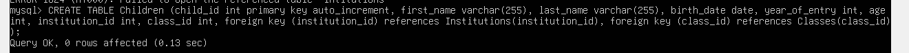
  
#### 2.2.4. Table: `Parents`

This table will store information about the parents of the children.

- **Fields**:
   - `parent_id`: Primary key, auto-increment
   - `first_name`: Parent's first name
   - `last_name`: Parent's last name
   - `child_id`: Foreign key referencing `Children`
   - `tuition_fee`: Tuition fee for the child
  
     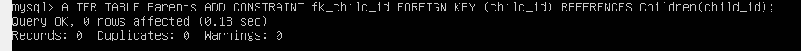
  
## 3. Data Insertion

Once the tables are created, insert at least 3 realistic records into each of the tables to simulate real-world data. Make sure to include:

- **Institutions**: At least one school and one kindergarten with proper names and addresses.
- **Classes**: Include several classes with distinct educational directions.
- **Children**: Provide details for children across different institutions and classes.
- **Parents**: Insert information about the parents and the tuition fees for their children.

  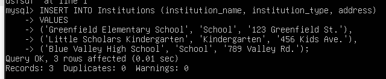
  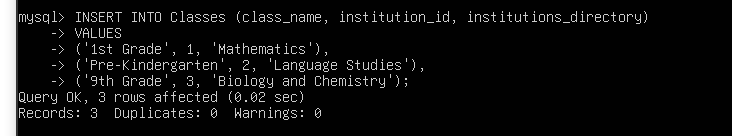
  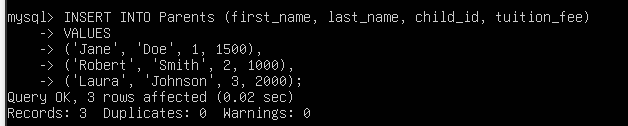
  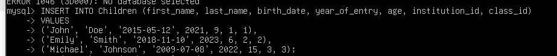

## 4. SQL Queries

You are required to write and execute SQL queries to retrieve specific information from the database. The queries should include:

### 4.1. Query: List of Children, Their Institutions, and Class Directions

Retrieve a list of all children, the institution they are enrolled in, and the educational direction of their class.
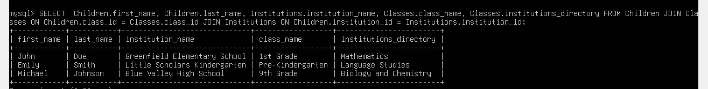

### 4.2. Query: Information on Parents, Their Children, and Tuition Fees

Retrieve details of the parents and their children, along with the corresponding tuition fees.
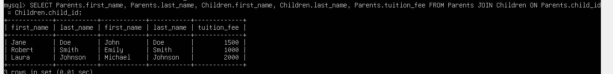
### 4.3. Query: List of Institutions and the Number of Children Enrolled

Retrieve a list of all institutions, along with their addresses and the number of children enrolled in each institution.
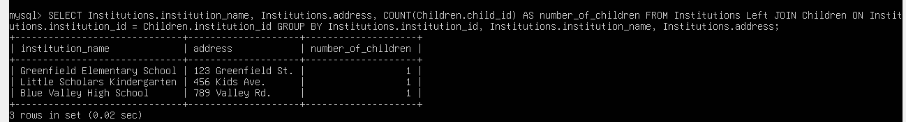

## 5. Database Backup and Restore

You will also need to create a backup of the database and perform a restore operation to ensure data integrity.

### 5.1. Backup

Create a backup of the database by exporting its current state.

### 5.2. Restore

Restore the database from the backup to a new database and verify that the data integrity is maintained.

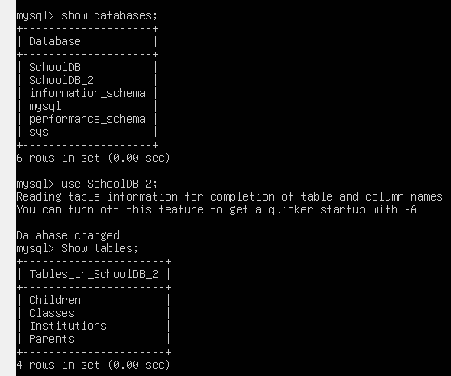
---

## 6. Conclusion

This project demonstrates the process of setting up and managing a school database. After creating the database and tables, you will insert realistic data, perform various SQL queries, and ensure the integrity of the data through backup and restoration procedures.
