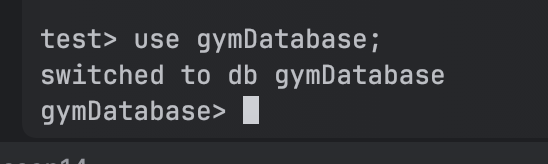
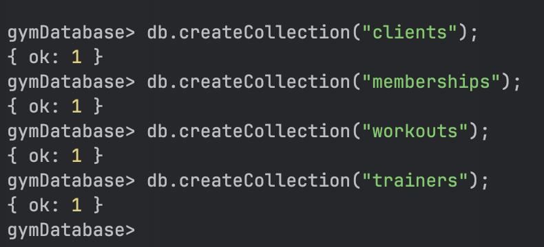
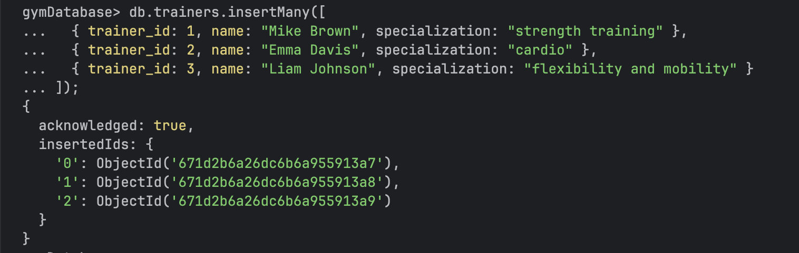
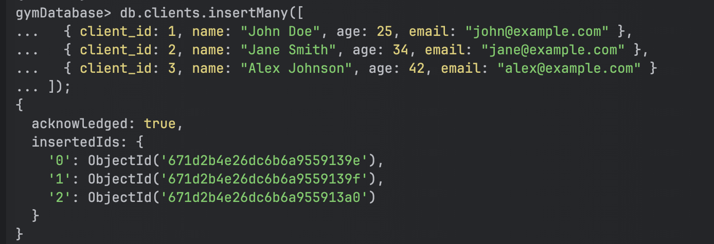
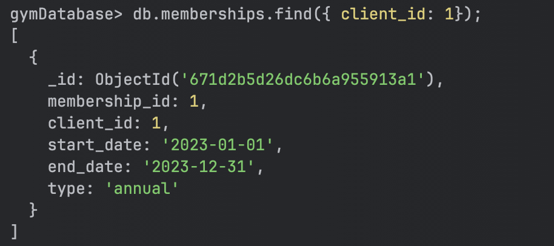
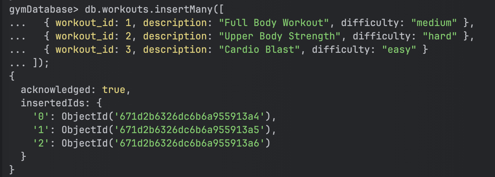
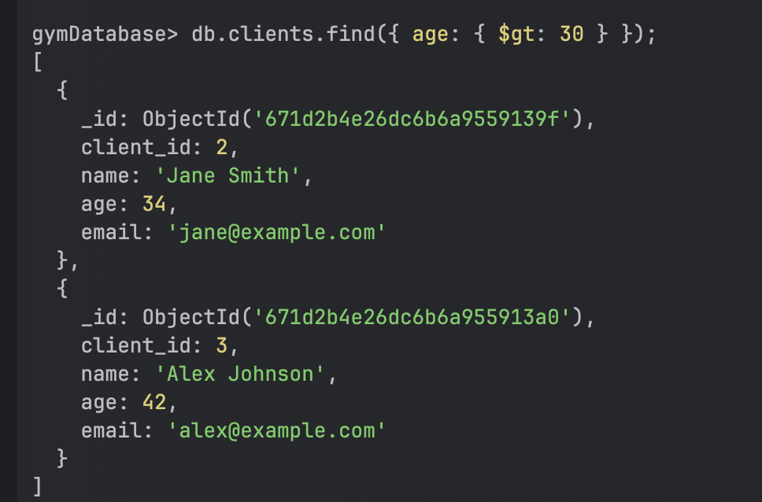
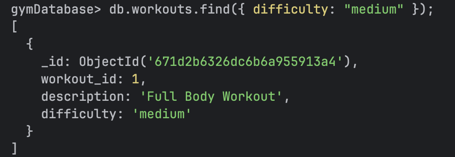
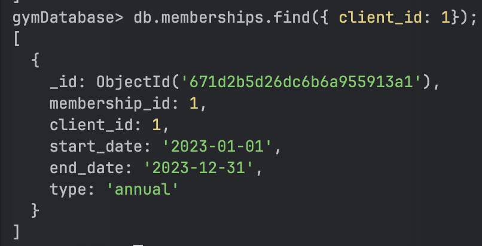

# Gym Database Setup and Documentation

This document outlines the structure and setup instructions for creating and managing a gym database in MongoDB. The database, named `gymDatabase`, will contain collections for clients, memberships, workouts, and trainers.

## Database and Collection Creation

### Database
- **Database Name**: `gymDatabase`
    

### Collections
1. **clients**
2. **memberships**
3. **workouts**
4. **trainers**
   
## Document Schemas

Each collection contains documents with specific fields as defined below.

### clients
- **client_id**: Unique identifier for each client
- **name**: Name of the client
- **age**: Age of the client
- **email**: Email address of the client
   

### memberships
- **membership_id**: Unique identifier for each membership
- **client_id**: Reference to the client in the `clients` collection
- **start_date**: Start date of the membership
- **end_date**: End date of the membership
- **type**: Type of membership (e.g., annual, semi-annual, quarterly)
  

### workouts
- **workout_id**: Unique identifier for each workout
- **description**: Description of the workout
- **difficulty**: Difficulty level of the workout (e.g., easy, medium, hard)

### trainers
- **trainer_id**: Unique identifier for each trainer
- **name**: Name of the trainer
- **specialization**: Area of specialization for the trainer
  

## Data Population

Insert sample data into each collection. This includes:
- Adding several records for each client with fields as per the `clients` schema.
- Adding membership details linked to each client in the `memberships` collection.
- Adding a variety of workout descriptions and difficulty levels in the `workouts` collection.
- Adding trainer details with their specializations in the `trainers` collection.
  
  
  
  
## Query Instructions

### Queries to Execute

1. **Find all clients over the age of 30.**
2. **List workouts with a medium difficulty level.**
3. **Display membership information for a specific client based on their client_id.**
   
   
   

