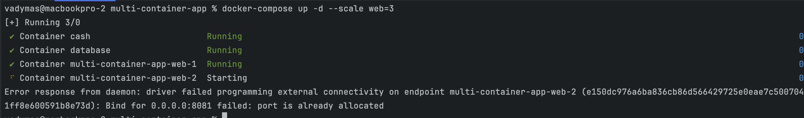
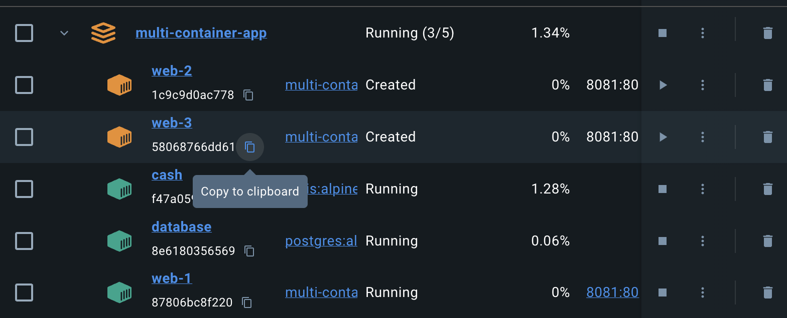

# Багатоконтейнерний додаток з Docker Compose

## Огляд проєкту

Під час виконання цього завдання я здобув практичний досвід використання `docker-compose`, налаштовуючи середовище з кількома контейнерами та трьома сервісами, заснованими на офіційних Docker-образах. Середовище включає:

- Користувацький `Dockerfile` для сервісу Nginx, що дозволяє створити об’єм (volume) для внутрішніх потреб системи та мапінгу директорії проєкту. Це налаштування дозволило завантажити HTML-файл у контейнер Nginx, який надав сторінку через веб-інтерфейс.

## Використані основні команди

Для виконання завдання були використані наступні команди:

- `docker-compose up -d` — запуск усіх сервісів у фоновому режимі.
- `docker network ls` — для перегляду створених мереж.
- `docker volume ls` — для перегляду створених томів.
- `docker exec` — для доступу до командного рядка контейнера та виконання команд всередині нього.

## Виниклі труднощі

При спробі масштабувати веб-сервіс за допомогою `docker-compose up -d --scale web=3` контейнери `web2` і `web3` були створені, але не запущені через конфлікт портів. Однак основний контейнер `web1` працював коректно та обслуговував додаток, як очікувалося.

