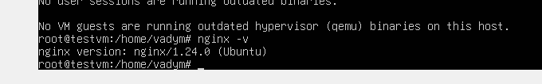

# Інструкція з налаштування VirtualBox

## 1. Встановлення VirtualBox

1. Завантажте та встановіть останню версію VirtualBox з офіційного сайту [VirtualBox](https://www.virtualbox.org/).
   
2. Переконайтеся, що VirtualBox успішно встановлено, та запустіть його.
   
## 2. Створення нової віртуальної машини

Створіть нову віртуальну машину з наступними параметрами:
    - **Назва:** TestVM
    - **Тип:** Linux
    - **Версія:** Ubuntu (64-bit)
    - **Оперативна пам'ять:** 2 ГБ
    - **Віртуальний жорсткий диск:** 20 ГБ у форматі VDI (VirtualBox Disk Image)
   

## 3. Налаштування VM

1. Встановіть процесор на 2 ядра.
2. Активуйте опцію **Enable EFI (special OSes only)**.
3. Переконайтеся, що мережевий адаптер налаштований на тип **Bridged Adapter**, щоб VM могла отримати IP-адресу з локальної мережі.
   
   
   

## 4. Інсталяція операційної системи

1. Завантажте ISO-образ Ubuntu (остання LTS-версія) з офіційного сайту Ubuntu.
2. Додайте цей образ у налаштування VM як оптичний диск і запустіть VM.
3. Виконайте інсталяцію Ubuntu на вашу віртуальну машину.
   
   

## 5. Збереження та відновлення стану VM

1. Створіть знімок (snapshot) вашої VM після налаштування системи.
2. Запустіть кілька базових команд (наприклад, створення файлу) в системі, а потім відновіть VM до попереднього знімку. Переконайтеся, що внесені зміни зникли.
   
   
   
   
   
   
   

## 6. Зміна параметрів віртуальної машини через графічний інтерфейс

1. **Збільшення розміру жорсткого диску:**
    - Вимкніть VM.
    - Відкрийте налаштування VM, перейдіть до розділу **Storage**, виберіть диск і натисніть на кнопку **Resize**. Встановіть новий розмір диску (наприклад, 30 ГБ).
    - Після збільшення розміру диску розширте файлову систему всередині Ubuntu, щоб новий простір був доступний для використання.
      

      
      
      

2. **Зміна кількості процесорних ядер та оперативної пам'яті:**
    - Перейдіть до розділу **System**, у вкладці **Processor** збільште кількість ядер CPU на 4, а у вкладці **Motherboard** збільште обсяг оперативної пам'яті на 4 ГБ.
    - Перевірте, що зміни успішно застосовані, і переконайтеся, що дані на диску залишилися недоторканими.
      Так як параметри мого комп'ютера не дозволяють підняти параметри до рівня завдання, то створив віртуальну машину з 1GB і 1CPU
      
      
      
      

## 7. Вимкнення та видалення VM

1. Коректно вимкніть вашу VM через систему.
2. Видаліть VM з VirtualBox разом з усіма пов'язаними файлами (жорстким диском).
   
