# Завдання

1. **Встановити й налаштувати вебсервер Nginx через офіційний репозиторій**:
   - Додати й видалити PPA-репозиторій для Nginx.
      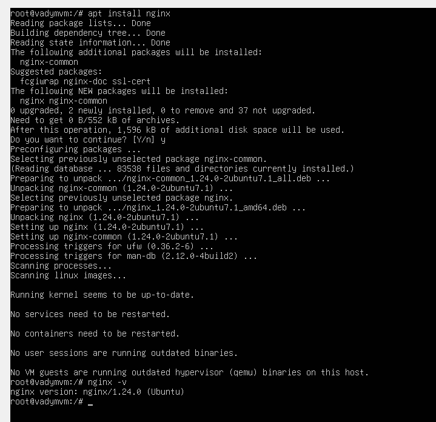
      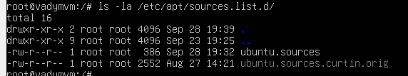
      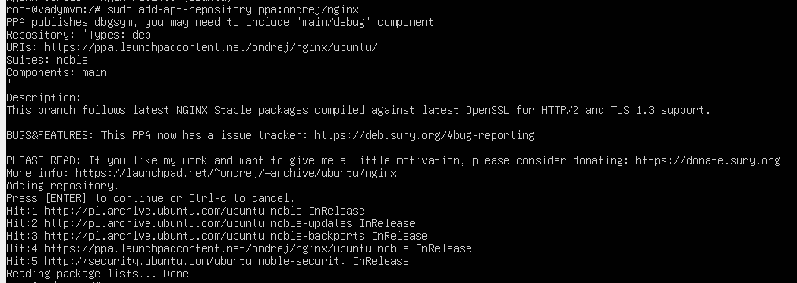
      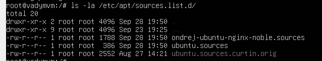
      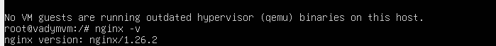
   - Повернутися до офіційної версії пакета за допомогою `ppa-purge`.
     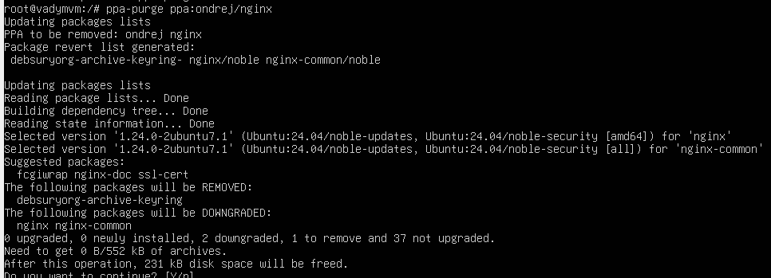
     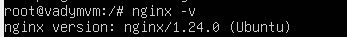

2. **Написати й налаштувати власний systemd-сервіс**:
   - Сервіс має запускати простий скрипт, який щохвилини записує поточну дату й час у файл.
     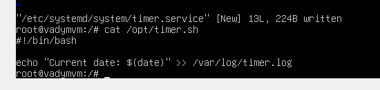
     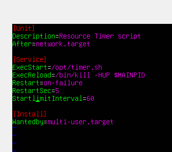
     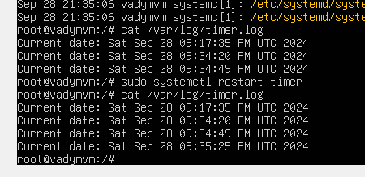
     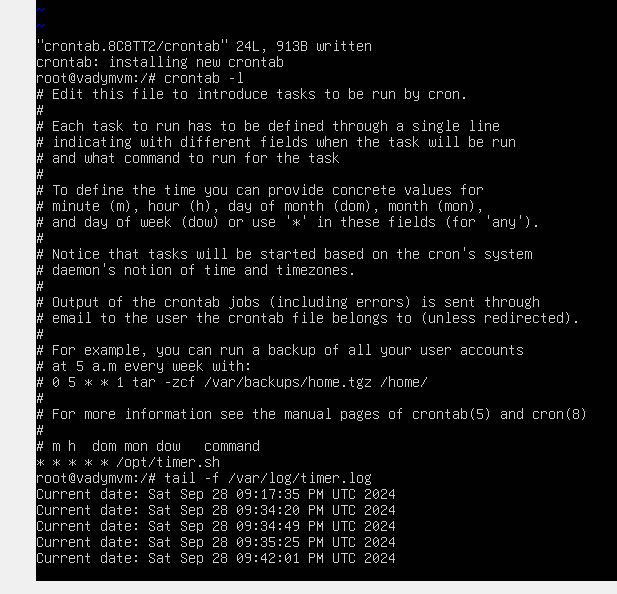
     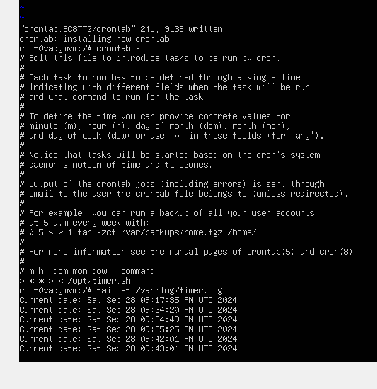

3. **Налаштувати брандмауер за допомогою UFW або iptables**:
   - Заборонити доступ до порту 22 (SSH) з одного IP, але дозволити з іншого IP.
     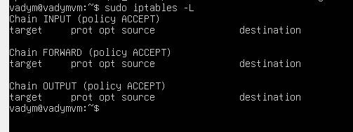
     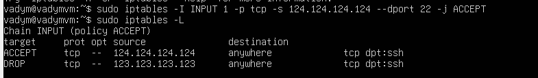

4. **Налаштувати Fail2Ban для захисту від підбору паролів через SSH**.
   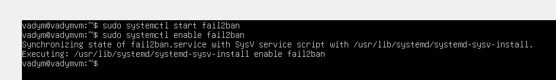
   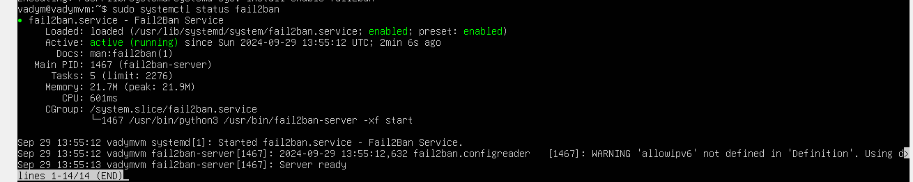
